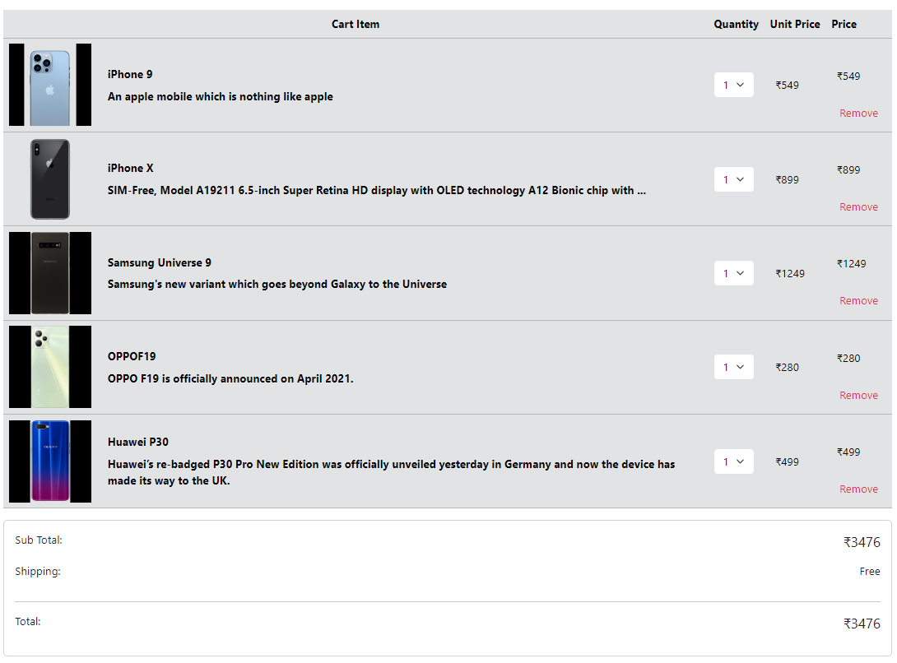

# Cart Page using UseContext hook.

## Table Columns are with item, quantity,unit price, price.
## Sub Total and Total will change based on selected quantity and items if removed.
## Output will look like as shown below

